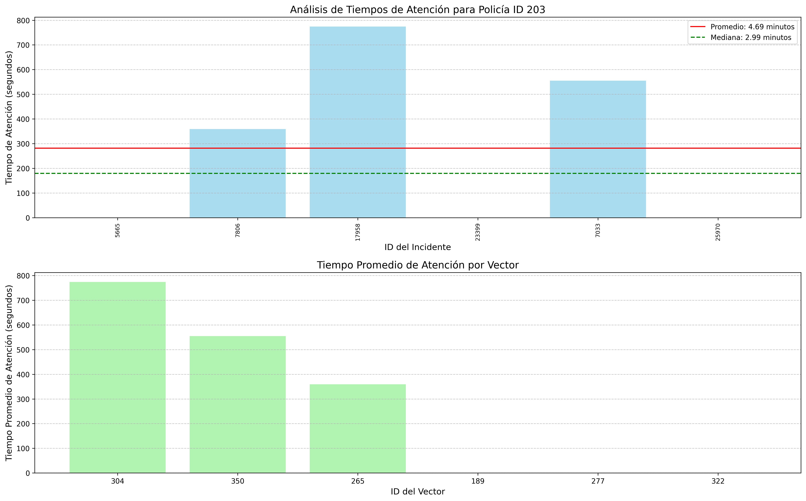
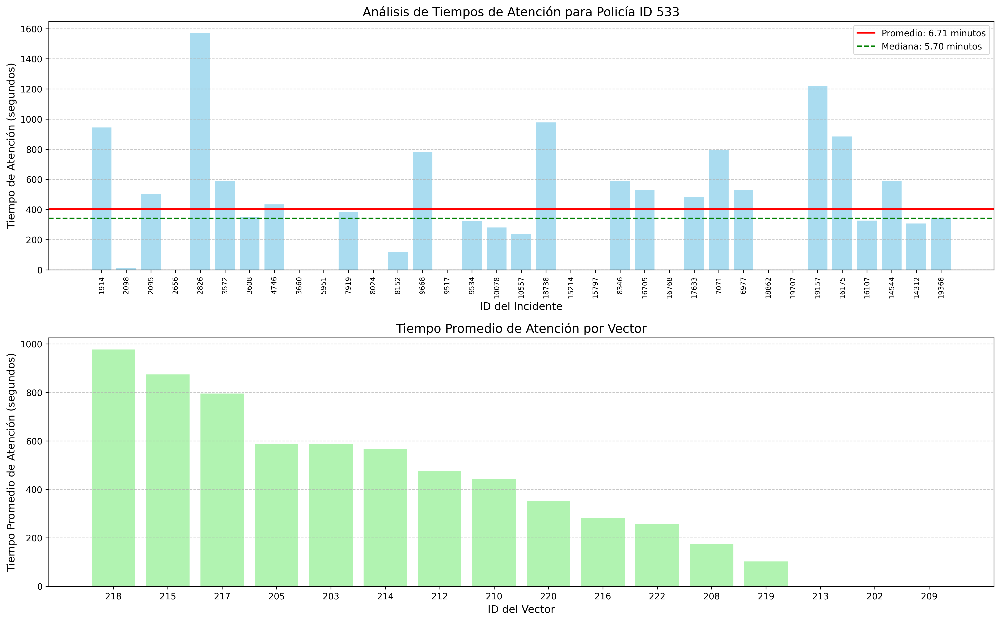
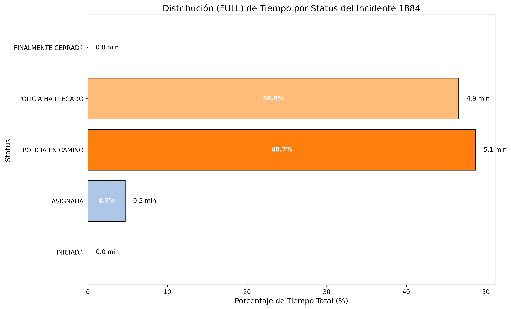
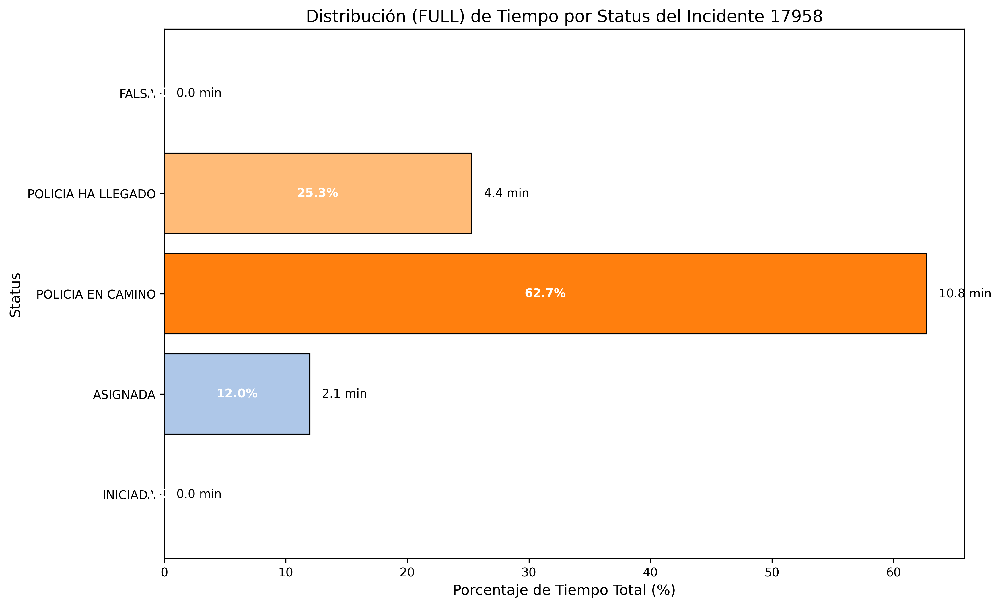
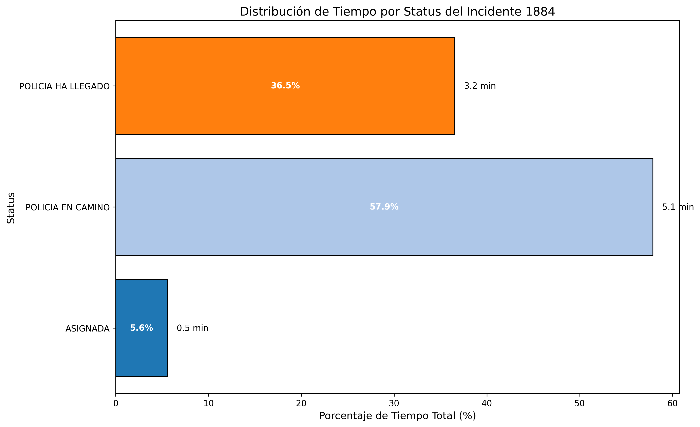
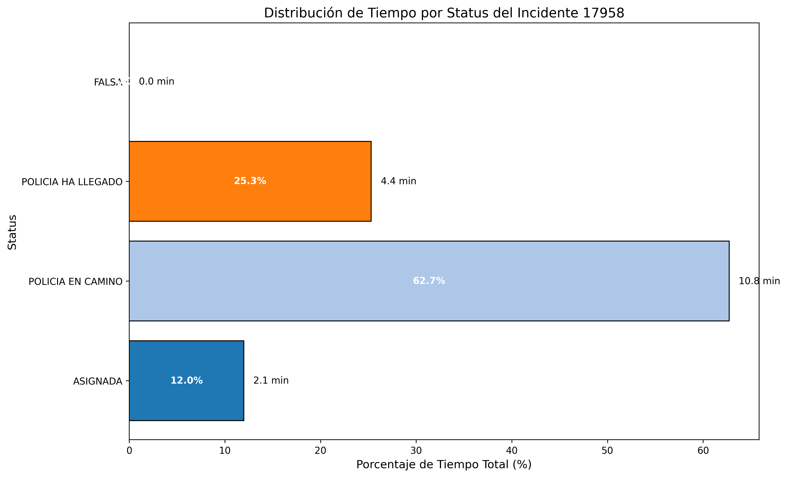

# Proyecto FastAPI

Este es un proyecto estándar de FastAPI que utiliza PostgreSQL como base de datos. Los modelos, esquemas, rutas y el archivo app.py tienen sus funcionalidades básicas implementadas para manejar la lógica de la API.

## Objetivo Principal de la API

### 1. Identificar todos los incidentes atendidos por un oficial de policía
Este análisis se realiza consultando la siguiente ruta:

```
@router.get("/security_incident/police/{police_id}/analysis")
```

Esta ruta devuelve un análisis completo de los incidentes asignados a un oficial de policía específico.

#### Ejemplo de Gráficos Generados:



---

### 2. Analizar el tiempo transcurrido en los diferentes estados de un incidente
Este análisis permite entender cuánto tiempo tomó atender un incidente, desglosado por los diferentes estados del incidente. Existen 2 versiones:

a. Version FULL que muestra todos los status por los que pasó el incidente incluyendo la Asignación y el Cierre generado por el monitor.

Este análisis se realiza consultando la siguiente ruta:

```
@router.get("/incident_tracking_states/{incident_id}/analysis_full")
```

#### Ejemplo de Gráficos Generados:



b. Version SIMPLE que muestra solo los status por los que pasó el incidente visto del lado del Policía.

Este análisis se realiza consultando la siguiente ruta:

```
@router.get("/incident_tracking_states/{incident_id}/analysis")
```

#### Ejemplo de Gráficos Generados:




---

## Tecnologías Utilizadas

- **Python**: 3.12.3
- **FastAPI**: Framework principal para la API.
- **PostgreSQL**: Base de datos relacional.
- **SQLAlchemy**: ORM para interactuar con la base de datos.
- **Pandas**: Procesamiento de datos.
- **Matplotlib**: Generación de gráficos.
- **Numpy**: Cálculos numéricos.
- **Scikit-learn**: Herramientas adicionales para análisis de datos.

---