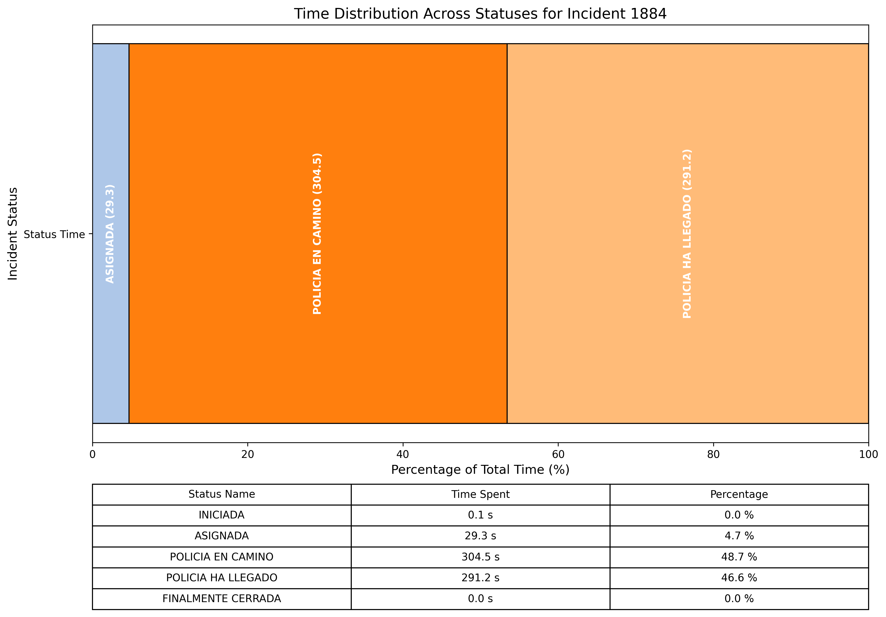

# Proyecto FastAPI

Este es un proyecto estándar de FastAPI que utiliza PostgreSQL como base de datos. Los modelos, esquemas, rutas y el archivo app.py tienen sus funcionalidades básicas implementadas para manejar la lógica de la API.

## Objetivo Principal de la API

### 1. Identificar todos los incidentes atendidos por un oficial de policía
Este análisis se realiza consultando la siguiente ruta:

```
@router.get("/security_incident/police/{police_id}/analysis")
```

Esta ruta devuelve un análisis completo de los incidentes asignados a un oficial de policía específico. El script ubicado en police_all_incidents.py consume esta información y genera gráficos que resumen los datos. Para ejecutar este análisis, utiliza el siguiente comando:

```bash
python analysis/police_all_incidents.py <police_id>
```

#### Ejemplo de Gráficos Generados:


---

### 2. Analizar el tiempo transcurrido en los diferentes estados de un incidente
Este análisis permite entender cuánto tiempo tomó atender un incidente, desglosado por los diferentes estados del incidente. El script ubicado en incident_all_states.py realiza este análisis de manera independiente, consultando dos rutas de la API (para realizar el mapeo de IDs con sus nombres) y procesando los datos internamente. Para ejecutar este análisis, utiliza el siguiente comando:

```bash
python analysis/incident_all_states.py <incident_id>
```

El script genera gráficos que se guardan en el directorio "output" especificado.

#### Ejemplo de Gráficos Generados:



---

## Tecnologías Utilizadas

- **Python**: 3.12.3
- **FastAPI**: Framework principal para la API.
- **PostgreSQL**: Base de datos relacional.
- **SQLAlchemy**: ORM para interactuar con la base de datos.
- **Pandas**: Procesamiento de datos.
- **Matplotlib**: Generación de gráficos.
- **Numpy**: Cálculos numéricos.
- **Scikit-learn**: Herramientas adicionales para análisis de datos.

---